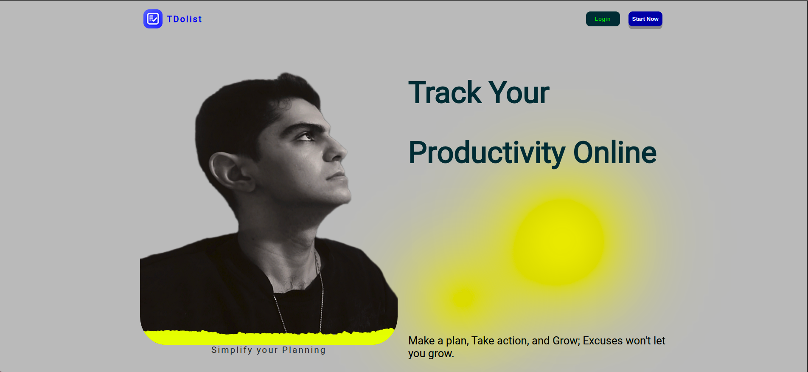
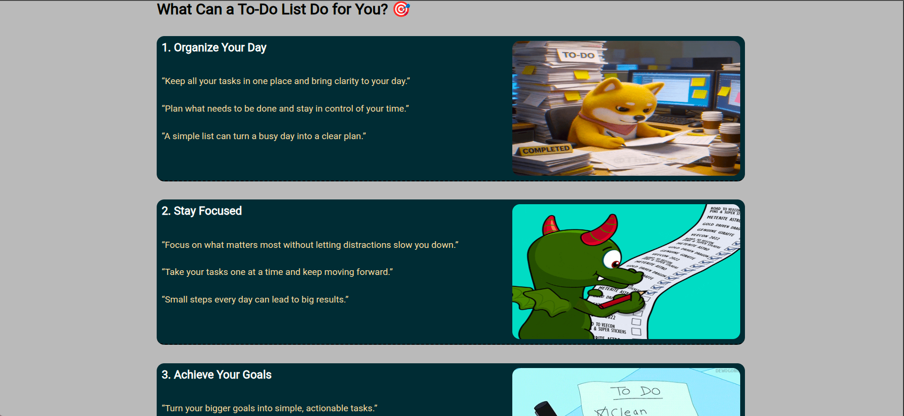
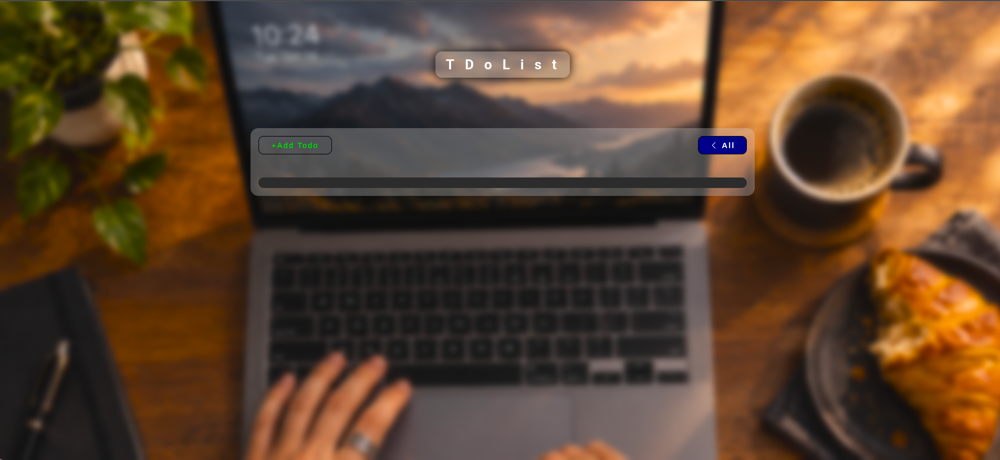
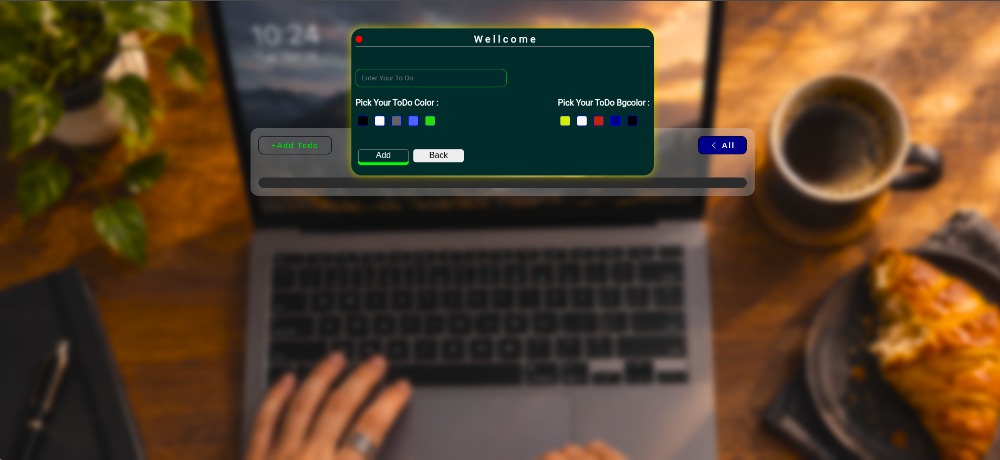
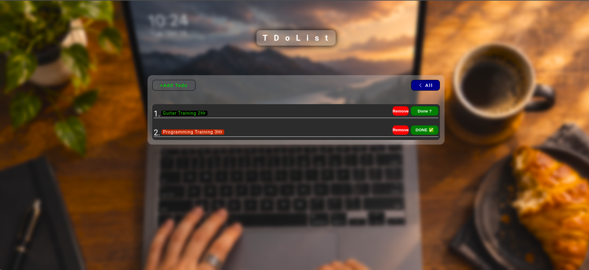

<p align="center">
  
  
  
</p>

<p align="center">
  
  
</p>


# 📝 Todo List

A simple and interactive Todo List web application built with **HTML, CSS, and JavaScript**.

This project was created as a practice project to improve my skills in DOM manipulation, JavaScript arrays and objects, events, and browser LocalStorage.

## ✨ Features

- ➕ Add new todos
- 🚫 Prevent adding empty todos
- ✅ Mark todos as completed
- 🗑️ Delete todos
- 🎨 Customize todo text color
- 🖌️ Customize todo background color
- 💾 Save todos using LocalStorage
- 🔄 Restore todos after refreshing the page
- 🔢 Automatic todo numbering
- ⌨️ Close the todo form with the `Escape` key
- 📱 Responsive design

## 🛠️ Technologies

- HTML5
- CSS3
- JavaScript (Vanilla JS)
- LocalStorage API

## 🧠 What I Practiced

While building this project, I practiced:

- DOM manipulation
- Event handling
- Arrays and objects
- `forEach()`
- `findIndex()`
- `splice()`
- Conditional rendering
- Ternary operators
- LocalStorage
- JSON
- Dynamic HTML rendering
- Working with `data-*` attributes
- Managing application state

## 📂 Project Structure

```text
Todo-List/
│
├── index.html
├── style.css
├── script.js
└── assets/
